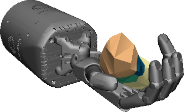
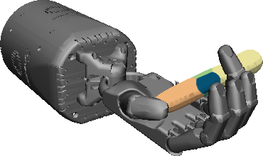
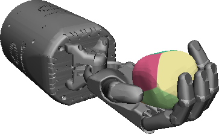

## Generalization in Dexterous Manipulation via</br>Geometry-Aware Multi-Task Learning
#### [[Project Page]](https://huangwl18.github.io/geometry-dex/) [[Paper]](https://wenlong.page/papers/geometry-dex.pdf)

[Wenlong Huang](https://wenlong.page)<sup>1</sup>, [Igor Mordatch](https://scholar.google.com/citations?user=Vzr1RukAAAAJ&hl=en)<sup>2</sup>, [Pieter Abbeel](http://people.eecs.berkeley.edu/~pabbeel/)<sup>1</sup>, [Deepak Pathak](https://www.cs.cmu.edu/~dpathak/)<sup>3</sup>

<sup>1</sup>University of California, Berkeley, <sup>2</sup>Google Brain, <sup>3</sup>Carnegie Mellon University<br/>


This is a PyTorch implementation of our [Geometry-Aware Multi-Task Policy](https://huangwl18.github.io/geometry-dex/). The codebase also includes a suite of dexterous manipulation environments with 114 diverse real-world objects built upon [Gym](https://github.com/openai/gym) and [MuJoCo](https://mujoco.org).

We show that a single generalist policy can perform in-hand manipulation of over 100 geometrically-diverse real-world objects and generalize to new objects with unseen shape or size. Interestingly, we find that multi-task learning with object point cloud representations not only generalizes better but even outperforms the single-object specialist policies on both training as well as held-out test objects.

If you find this work useful in your research, please cite using the following BibTeX:

    @article{huang2021geometry,
      title={Generalization in Dexterous Manipulation via Geometry-Aware Multi-Task Learning},
      author={Huang, Wenlong and Mordatch, Igor and Abbeel, Pieter and Pathak, Deepak},
      journal={arXiv preprint arXiv:2111.03062},
      year={2021}
    }


## Setup

### Requirements
- Python=3.6.9
- CUDA=10.2
- CUDNN=7.6.5
- MuJoCo=1.50 ([Installation Instructions](https://github.com/openai/mujoco-py/tree/1.50.1.1#synopsis))

### Setup Instructions
```Shell
git clone https://github.com/huangwl18/geometry-dex.git
cd geometry-dex/
conda create --name geometry-dex-env python=3.6.9
conda activate geometry-dex-env
pip install --upgrade pip
pip install -r requirements.txt
bash install-baselines.sh
```

## Running Code
Below are some flags and parameters for ``run_ddpg.py`` that you may find useful for reference:

| Flags and Parameters  | Description |
| ------------- | ------------- |
| ``--expID <INT>``  | Experiment ID |
| ``--train_names <List of STRING>``  | list of environments for training; separated by space  |
| ``--test_names <List of STRING>``  | list of environments for zero-shot testing; separated by space  |
| ``--point_cloud``  |  Use geometry-aware policy |
| ``--pointnet_load_path <INT>``  | Experiment ID from which to load the pre-trained Pointnet; required for ``--point_cloud``  |
| ``--video_count <INT>``  | Number of videos to generate for each env per cycle; only up to ``1`` is currently supported; ``0`` to disable |
| ``--n_test_rollouts <INT>``  |  Total number of collected rollouts across all train + test envs for each evaluation run; should be multiple of ``len(train_names) + len(test_names)`` |
| ``--num_rollouts <INT>``  |  Total number of collected rollouts across all train envs for 1 training cycle; should be multiple of ``len(train_names)`` |
| ``--num_parallel_envs <INT>``  | Number of parallel envs to create for ``vec_env``; should be multiple of ``len(train_names)`` |
| ``--chunk_size <INT>``  |  Number of parallel envs asigned to each worker in ``SubprocChunkVecEnv``; ``0`` to disable and use ``SubprocVecEnv``|
| ``--num_layers <INT>``  |  Number of layers in MLP for all policies |
| ``--width <INT>``  |  Width of each layer in MLP for all policies |
| ``--seed <INT>``  | seed for Gym, PyTorch and NumPy  |
| ``--eval``  |  Perform only evaluation using latest checkpoint|
| ``--load_path <INT>``  |  Experiment ID from which to load the checkpoint for DDPG; required for ``--eval`` |


The code also uses [WandB](https://wandb.ai/site). You may wish to run ``wandb login`` in terminal to record to your account or choose to run anonymously.

**WARNING:** Due to the large number of total environments, generating videos during training can be slow and memory intensive. You may wish to train the policy without generating videos by passing ``video_count=0``. After training completes, simply run ``run_ddpg.py`` with flags ``--eval`` and ``--video_count=1`` to visualize the policy. See example below.


### Training

To train Vanilla Multi-Task DDPG policy:
```Shell
python run_ddpg.py --expID 1 --video_count 0 --n_cycles 40000 --chunk 10
```

To train Geometry-Aware Multi-Task DDPG policy, first pretrain PointNet encoder:
```Shell
python train_pointnet.py --expID 2
```
Then train the policy:
```Shell
python run_ddpg.py --expID 3 --video_count 0 --n_cycles 40000 --chunk 10 --point_cloud --pointnet_load_path 2 --no_save_buffer
```
Note we don't save replay buffer here because it is slow as it contains sampled point clouds. If you wish to resume training in the future, do not pass ``--no_save_buffer`` above.

### Evaluation / Visualization

To evaluate a trained policy and generate video visualizations, run the same command used to train the policy but with additional flags ``--eval --video_count=<VIDEO_COUNT> --load_path=<LOAD_EXPID>``. Replace ``<VIDEO_COUNT>`` with ``1`` if you wish to enable visualization and ``0`` otherwise. Replace ``<LOAD_EXPID>`` with the Experiment ID of the trained policy. For a Geometry-Aware Multi-Task DDPG policy trained using above command, run the following for evaluation and visualization:
```Shell
python run_ddpg.py --expID 4 --video_count 1 --n_cycles 40000 --chunk 10 --point_cloud --pointnet_load_path 2 --no_save_buffer --eval --load_path 3
```

### Trained Models

We will be releasing trained model files for our Geometry-Aware Policy and single-task oracle policies for each individual object. Stay tuned! Early access can be requested via [email](mailto:wenlong.huang@berkeley.edu).

## Provided Environments


<table>
    <tbody>
        <tr>
            <td align="center" style="text-align:center" colspan=5><b>Training Envs</b></td>
        </tr>
        <tr>
        <td align="center" style="text-align:center"><br><sub>e_toy_airplane</sub></td>
        <td align="center" style="text-align:center"><br><sub>knife</sub></td>
        <td align="center" style="text-align:center"><br><sub>flat_screwdriver</sub></td>
        <td align="center" style="text-align:center"><br><sub>elephant</sub></td>
        <td align="center" style="text-align:center"><br><sub>apple</sub></td>
        </tr>
        <tr>
        <td align="center" style="text-align:center"><br><sub>scissors</sub></td>
        <td align="center" style="text-align:center"><br><sub>i_cups</sub></td>
        <td align="center" style="text-align:center"><br><sub>cup</sub></td>
        <td align="center" style="text-align:center"><br><sub>foam_brick</sub></td>
        <td align="center" style="text-align:center"><br><sub>pudding_box</sub></td>
        </tr>
        <tr>
        <td align="center" style="text-align:center"><br><sub>wristwatch</sub></td>
        <td align="center" style="text-align:center"><br><sub>padlock</sub></td>
        <td align="center" style="text-align:center"><br><sub>power_drill</sub></td>
        <td align="center" style="text-align:center"><br><sub>binoculars</sub></td>
        <td align="center" style="text-align:center"><br><sub>b_lego_duplo</sub></td>
        </tr>
        <tr>
        <td align="center" style="text-align:center"><br><sub>ps_controller</sub></td>
        <td align="center" style="text-align:center"><br><sub>mouse</sub></td>
        <td align="center" style="text-align:center"><br><sub>hammer</sub></td>
        <td align="center" style="text-align:center"><br><sub>f_lego_duplo</sub></td>
        <td align="center" style="text-align:center"><br><sub>piggy_bank</sub></td>
        </tr>
        <tr>
        <td align="center" style="text-align:center"><br><sub>can</sub></td>
        <td align="center" style="text-align:center"><br><sub>extra_large_clamp</sub></td>
        <td align="center" style="text-align:center"><br><sub>peach</sub></td>
        <td align="center" style="text-align:center"><br><sub>a_lego_duplo</sub></td>
        <td align="center" style="text-align:center"><br><sub>racquetball</sub></td>
        </tr>
        <tr>
        <td align="center" style="text-align:center"><br><sub>tuna_fish_can</sub></td>
        <td align="center" style="text-align:center"><br><sub>a_cups</sub></td>
        <td align="center" style="text-align:center"><br><sub>pan</sub></td>
        <td align="center" style="text-align:center"><br><sub>strawberry</sub></td>
        <td align="center" style="text-align:center"><br><sub>d_toy_airplane</sub></td>
        </tr>
        <tr>
        <td align="center" style="text-align:center"><br><sub>wood_block</sub></td>
        <td align="center" style="text-align:center"><br><sub>small_marker</sub></td>
        <td align="center" style="text-align:center"><br><sub>sugar_box</sub></td>
        <td align="center" style="text-align:center"><br><sub>ball</sub></td>
        <td align="center" style="text-align:center"><br><sub>torus</sub></td>
        </tr>
        <tr>
        <td align="center" style="text-align:center"><br><sub>i_toy_airplane</sub></td>
        <td align="center" style="text-align:center"><br><sub>chain</sub></td>
        <td align="center" style="text-align:center"><br><sub>j_cups</sub></td>
        <td align="center" style="text-align:center"><br><sub>c_toy_airplane</sub></td>
        <td align="center" style="text-align:center"><br><sub>airplane</sub></td>
        </tr>
        <tr>
        <td align="center" style="text-align:center"><br><sub>nine_hole_peg_test</sub></td>
        <td align="center" style="text-align:center"><br><sub>water_bottle</sub></td>
        <td align="center" style="text-align:center"><br><sub>c_cups</sub></td>
        <td align="center" style="text-align:center"><br><sub>medium_clamp</sub></td>
        <td align="center" style="text-align:center"><br><sub>large_marker</sub></td>
        </tr>
        <tr>
        <td align="center" style="text-align:center"><br><sub>h_cups</sub></td>
        <td align="center" style="text-align:center"><br><sub>b_colored_wood_blocks</sub></td>
        <td align="center" style="text-align:center"><br><sub>j_lego_duplo</sub></td>
        <td align="center" style="text-align:center"><br><sub>f_toy_airplane</sub></td>
        <td align="center" style="text-align:center"><br><sub>toothbrush</sub></td>
        </tr>
        <tr>
        <td align="center" style="text-align:center"><br><sub>tennis_ball</sub></td>
        <td align="center" style="text-align:center"><br><sub>mug</sub></td>
        <td align="center" style="text-align:center"><br><sub>sponge</sub></td>
        <td align="center" style="text-align:center"><br><sub>k_lego_duplo</sub></td>
        <td align="center" style="text-align:center"><br><sub>phillips_screwdriver</sub></td>
        </tr>
        <tr>
        <td align="center" style="text-align:center"><br><sub>f_cups</sub></td>
        <td align="center" style="text-align:center"><br><sub>c_lego_duplo</sub></td>
        <td align="center" style="text-align:center"><br><sub>d_marbles</sub></td>
        <td align="center" style="text-align:center"><br><sub>d_cups</sub></td>
        <td align="center" style="text-align:center"><br><sub>camera</sub></td>
        </tr>
        <tr>
        <td align="center" style="text-align:center"><br><sub>d_lego_duplo</sub></td>
        <td align="center" style="text-align:center"><br><sub>golf_ball</sub></td>
        <td align="center" style="text-align:center"><br><sub>k_toy_airplane</sub></td>
        <td align="center" style="text-align:center"><br><sub>b_cups</sub></td>
        <td align="center" style="text-align:center"><br><sub>softball</sub></td>
        </tr>
        <tr>
        <td align="center" style="text-align:center"><br><sub>wine_glass</sub></td>
        <td align="center" style="text-align:center"><br><sub>chips_can</sub></td>
        <td align="center" style="text-align:center"><br><sub>cube</sub></td>
        <td align="center" style="text-align:center"><br><sub>master_chef_can</sub></td>
        <td align="center" style="text-align:center"><br><sub>alarm_clock</sub></td>
        </tr>
        <tr>
        <td align="center" style="text-align:center"><br><sub>gelatin_box</sub></td>
        <td align="center" style="text-align:center"><br><sub>h_lego_duplo</sub></td>
        <td align="center" style="text-align:center"><br><sub>baseball</sub></td>
        <td align="center" style="text-align:center"><br><sub>light_bulb</sub></td>
        <td align="center" style="text-align:center"><br><sub>banana</sub></td>
        </tr>
        <tr>
        <td align="center" style="text-align:center"><br><sub>rubber_duck</sub></td>
        <td align="center" style="text-align:center"><br><sub>headphones</sub></td>
        <td align="center" style="text-align:center"><br><sub>i_lego_duplo</sub></td>
        <td align="center" style="text-align:center"><br><sub>b_toy_airplane</sub></td>
        <td align="center" style="text-align:center"><br><sub>pitcher_base</sub></td>
        </tr>
        <tr>
        <td align="center" style="text-align:center"><br><sub>j_toy_airplane</sub></td>
        <td align="center" style="text-align:center"><br><sub>g_lego_duplo</sub></td>
        <td align="center" style="text-align:center"><br><sub>cracker_box</sub></td>
        <td align="center" style="text-align:center"><br><sub>orange</sub></td>
        <td align="center" style="text-align:center"><br><sub>e_cups</sub></td>
        </tr>
    </tbody>
</table>

<table>
    <tbody>
        <tr>
            <td align="center" style="text-align:center" colspan=5><b>Test Envs</b></td>
        </tr>
        <tr>
        <td align="center" style="text-align:center"><br><sub>rubiks_cube</sub></td>
        <td align="center" style="text-align:center"><br><sub>dice</sub></td>
        <td align="center" style="text-align:center"><br><sub>bleach_cleanser</sub></td>
        <td align="center" style="text-align:center"><br><sub>pear</sub></td>
        <td align="center" style="text-align:center"><br><sub>e_lego_duplo</sub></td>
        </tr>
        <tr>
        <td align="center" style="text-align:center"><br><sub>pyramid</sub></td>
        <td align="center" style="text-align:center"><br><sub>stapler</sub></td>
        <td align="center" style="text-align:center"><br><sub>flashlight</sub></td>
        <td align="center" style="text-align:center"><br><sub>large_clamp</sub></td>
        <td align="center" style="text-align:center"><br><sub>a_toy_airplane</sub></td>
        </tr>
        <tr>
        <td align="center" style="text-align:center"><br><sub>tomato_soup_can</sub></td>
        <td align="center" style="text-align:center"><br><sub>fork</sub></td>
        <td align="center" style="text-align:center"><br><sub>cell_phone</sub></td>
        <td align="center" style="text-align:center"><br><sub>m_lego_duplo</sub></td>
        <td align="center" style="text-align:center"><br><sub>toothpaste</sub></td>
        </tr>
        <tr>
        <td align="center" style="text-align:center"><br><sub>flute</sub></td>
        <td align="center" style="text-align:center"><br><sub>stanford_bunny</sub></td>
        <td align="center" style="text-align:center"><br><sub>a_marbles</sub></td>
        <td align="center" style="text-align:center"><br><sub>potted_meat_can</sub></td>
        <td align="center" style="text-align:center"><br><sub>timer</sub></td>
        </tr>
        <tr>
        <td align="center" style="text-align:center"><br><sub>lemon</sub></td>
        <td align="center" style="text-align:center"><br><sub>utah_teapot</sub></td>
        <td align="center" style="text-align:center"><br><sub>train</sub></td>
        <td align="center" style="text-align:center"><br><sub>g_cups</sub></td>
        <td align="center" style="text-align:center"><br><sub>l_lego_duplo</sub></td>
        </tr>
        <tr>
        <td align="center" style="text-align:center"><br><sub>bowl</sub></td>
        <td align="center" style="text-align:center"><br><sub>door_knob</sub></td>
        <td align="center" style="text-align:center"><br><sub>mustard_bottle</sub></td>
        <td align="center" style="text-align:center"><br><sub>plum</sub></td>
        </tr>
    </tbody>
</table>


## Acknowledgement
The code is adapted from this [open-sourced implementation](https://github.com/TianhongDai/hindsight-experience-replay) of DDPG + HER. The object meshes are from the [YCB Dataset](https://www.ycbbenchmarks.com) and the [ContactDB Dataset](https://contactdb.cc.gatech.edu). We use ``SubprocChunkVecEnv`` from this [pull request of OpenAI Baselines](https://github.com/openai/baselines/pull/620) to speedup vectorized environments.
